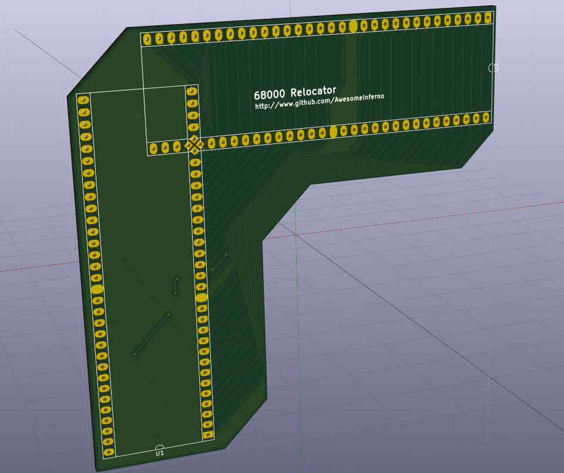

# 68000Relocator

Changes the orientation of a 68000 DIP CPU.

Primarily created to allow the TerribleFire TF530 accelerator board to better fit within an Amiga 500 case.

Boards available to purchase here: https://dirtypcbs.com/store/designer/details/AwesomeInferno/4830/68000relocator-gerbers-1-zip (Disclaimer: I get a very small kickback on each set sold)

